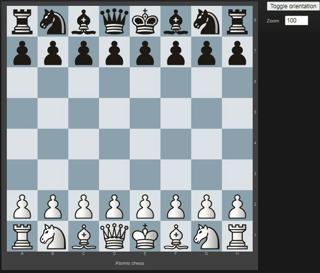

# Atomic chess explorer



# Usage

```
pip install Flask Flask-Failsafe Flask-Session python-chess
yarn install
yarn run dev

python server/runserver.py
```

Then browse http://127.0.0.1:8052

# Credits

This project is based upon [lichess' chessground](https://github.com/ornicar/chessground).
